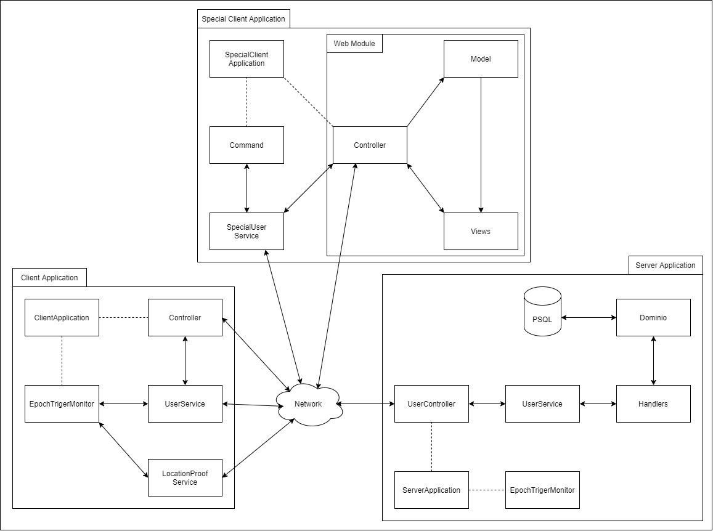
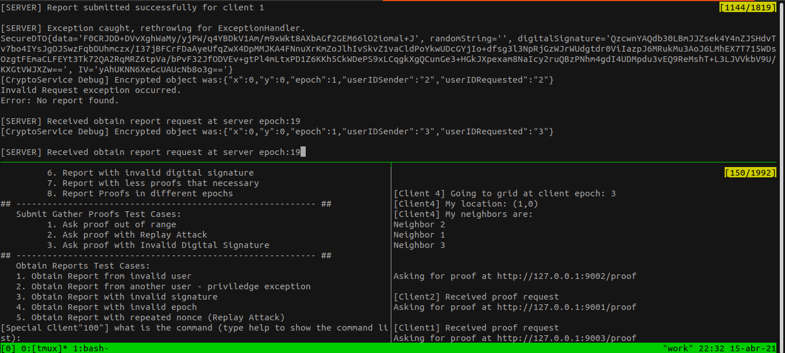
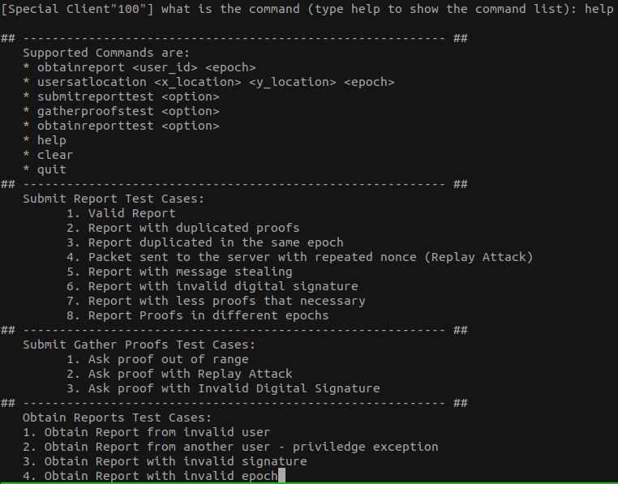

# Secure-Communication
The world pandemic we live in calls for tools for dependable location tracking and contact tracing. The goal of the project is to design and implement a “Highly Dependable Location Tracker”.

# Table of Contents
- [System Architecture Overview](#system-architecture-overview)
  - [Communication between entities](#communication-between-entities)
- [Deployment & Testing](#deployment-and-testing)

# System Architecture Overview

## Communication between entities
* All communication between Client and Server are encrypted and properly signed
* All communication between Special Client and Server are encrypted and properly signed
* All communication between Client and Client is in clear text but properly signed
* All communication between Special Client and Client is in clear text but properly signed
----
* Client can submit a report and obtain his reports from Server
* Client cans ask for proofs to other Clients
* Special Client can obtain report of valid users and obtain the users at a specific location at a given time
* \[EXTRA - Testing: Special Client can submit reports to Server and ask for proofs to other Clients (to act as a malicious user)\]

# Deployment and Testing

## Deployment

To deploy the project, the host computer requires to have Apache Maven, PostgreSQL installed and the JDK installed.
The following instructions are meant for linux operative systems (tested on Ubuntu 20.04):

Configuring the database:
- The database must operate locally on port 5432 with the user name 'postgres' and password 'root'. (This must be done in such a way that the
connection url is 'jdbc:postgresql://localhost:5432/sec'). To change the password of the default user postgres you need to connect to the psql instance (sudo -u postgres psql) and execute the command "ALTER USER postgres WITH PASSWORD 'root';"
- Create a database with the name 'sec': "sudo -u postgres createdb sec"

(This guide can be followed for the configuration https://www.digitalocean.com/community/tutorials/how-to-install-postgresql-on-ubuntu-20-04-quickstart-pt)

Configuring the clients and servers:
- Start 3 different terminals.
- Navigate to the "deploy" folder.
- Execute in the first terminal "sudo ./deploy_server.sh" and await around 15 seconds until you get the message that the server deployment is complete.
- Execute in the second terminal "sudo ./deploy_clients.sh".
- Execute in the third terminal "sudo ./deploy_special_user.sh".

The output of the API's (clients & server) will be printed to each terminal, so it can become very confusing to observe what is happening, for
that reason the deployment script will log all information printed to the logs folder e.g. "../deploy/logs/server_logs.txt". You can observe the log of each API in particular with the command "watch tail -n 15 server_logs.txt".

After executing the command there will be an initial delay of around 5 seconds before the clients start automatically sending location reports to the server.

Example organization:

## Testing

To test the functionalities of the project and possible attacks, the special user has a couple commands implemented which have byzantine cases
implemented. Those cases can be executed throught the commands "obtainreporttest case" (for server->client attacks), "submitreporttest case" (for client->server attacks) and "gatherproofstest case" (for attacks between clients).

To see all test possibilities execute the command "help" in the special user terminal.

